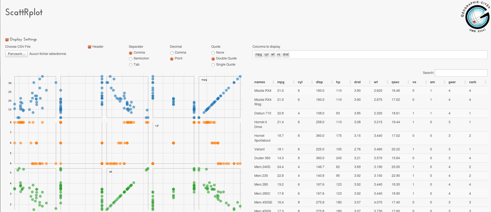

ScattRplot - An interactive scatterplot
===========================================================================================================

Mostly based on [TimelyPortfolio](https://github.com/timelyportfolio/shiny-d3-scatterplot), who did the R/Shiny Adaptation of [Mike Bostock's Amazing Interactive Scatterplot](http://bl.ocks.org/mbostock/4063663)

This app adds a linked datatable view of the scatterplot selected elements, and lets the user upload a custom table (csv format) and explore it.

Built using [R](http://r-project.org), [Shiny](http://rstudio.com/shiny) and [D3.js](http://d3js.org/).
Simplex bootstrap theme by [Thomas Park](http://thomaspark.me)

Released under AGPL v3 licence.